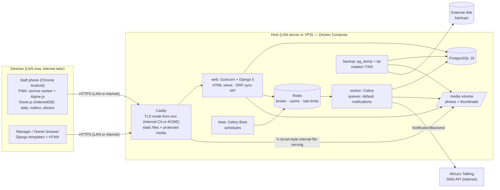
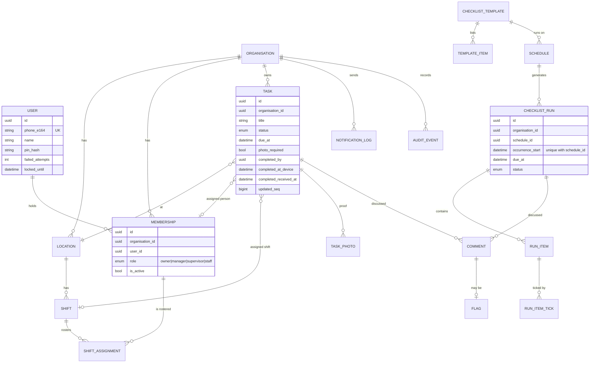
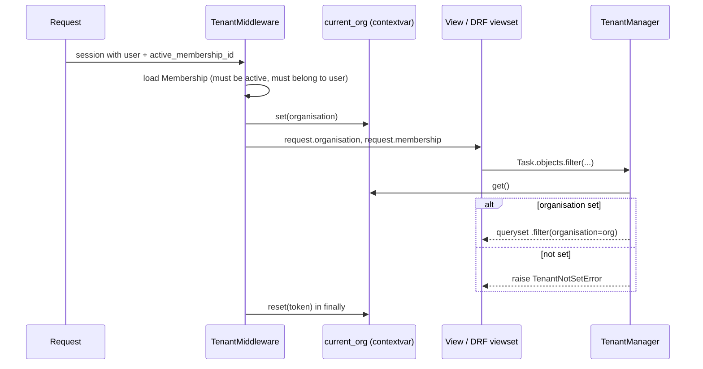
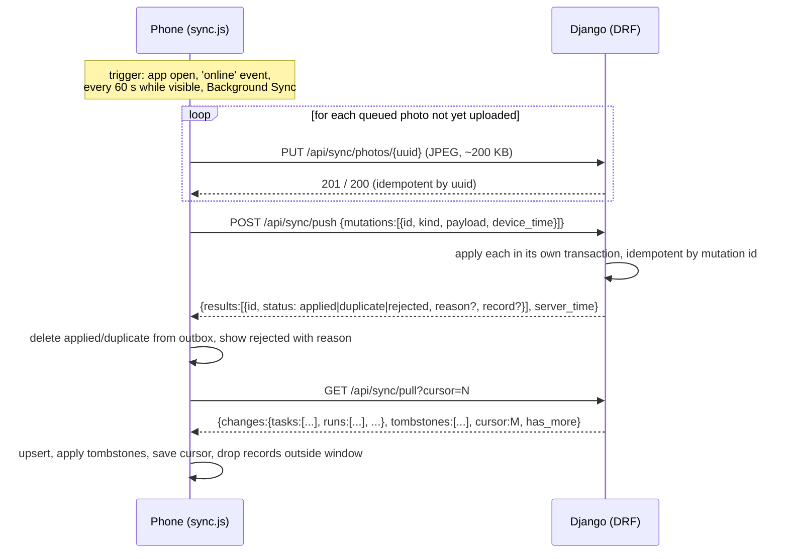

# 02 — Architecture: WorkFlow MVP

Status: Draft for review · Last updated: 2026-09-28 · Related: [01-requirements.md](01-requirements.md), [03-decisions.md](03-decisions.md)

This document describes how the MVP in `01-requirements.md` will be built. The reasons behind
each choice are in `03-decisions.md` (ADR numbers are given in brackets, for example [ADR-05]).

## 1. Overview

WorkFlow is a **Django 5 monolith** that runs on **one machine** under Docker Compose. That machine is a LAN server for the MVP, and the same images can later run on a public VPS with only `.env` changes [ADR-18]. It
has two front ends:

- A **staff field app**: a small offline-first PWA (service worker + Dexie.js + Alpine.js) that
  reads and writes local data and syncs through a DRF API [ADR-02, ADR-03].
- **Manager and admin pages**: server-rendered Django templates enhanced with HTMX, used
  online [ADR-01].

Background work (generating checklists, reminders, overdue alerts, SMS, purges, backups)
runs in **Celery** with **Celery Beat** for scheduling [ADR-09]. **Caddy** terminates HTTPS on
the LAN with an internal certificate authority, or with a public certificate on a VPS, chosen by env [ADR-12, ADR-18].

### 1.1 Component diagram



### 1.2 Repository layout (planned)

```
.
├── CLAUDE.md
├── docs/                       # these documents + WorkFlow.pdf
├── docker-compose.yml          # Docker Compose (caddy, web, db, redis, worker, beat)
├── Caddyfile
├── Dockerfile                  # multi-stage: tailwind build → python runtime
├── Makefile                    # up, down, migrate, test, lint, shell, backup, restore, …
├── pyproject.toml              # deps, ruff, pytest config
├── .env.example
├── scripts/                    # backup.sh, restore.sh
├── manage.py
├── workflow/                   # Django project: settings/{base,dev,prod}.py, urls, celery.py, wsgi
├── accounts/                   # User (phone + PIN), PinSetupToken, PIN auth backend, lockout
├── organisations/              # Organisation, Location, Membership, Shift, ShiftAssignment, AuditEvent
│                               #   + tenancy core: tenancy.py, middleware.py, permissions.py
├── tasks/                      # Task, TaskPhoto, TaskComment, transitions.py (state machine)
├── checklists/                 # ChecklistTemplate/Item, RecurrenceRule, ChecklistRun/RunItem/Tick, generator
├── notifications/              # Notification, SmsUsage, backends, dispatch, SMS templates
├── dashboard/                  # aggregate queries + HTMX views (no models)
├── sync/                       # OfflineSyncLog, DRF pull/push/photo endpoints, mutation handlers
├── templates/                  # base.html + per-app templates
├── frontend/
│   ├── tailwind/               # input.css (built by the standalone CLI)
│   ├── field/                  # staff PWA: Alpine components, db.js (Dexie), sync.js
│   └── vendor/                 # pinned htmx, alpine, dexie builds (no npm) + VERSIONS
├── static/                     # sw.js, manifest.json, icons
└── tests/                      # pytest: unit, integration, tenancy, e2e (Playwright)
```

App names and the final model list are defined in [04-design.md](04-design.md) §1.

---

## 2. Data model

> **The full model list, fields, constraints and indexes are in [04-design.md](04-design.md) §1.** The sketch below shows the shape; where names differ (for example `Schedule` → `RecurrenceRule`, `Comment` → `TaskComment`, `Flag` → task/run status `flagged`), 04 is correct.

All tenant-owned tables have a UUID primary key [ADR-07], a non-null `organisation_id`,
`created_at`, `updated_at`, and `updated_seq` (a value from one global PostgreSQL sequence,
used as the sync cursor). Deleted records that phones may have cached are soft-deleted
(`deleted_at`) so the deletion can be synced as a tombstone.



Notes:
- `User` is **global** (a phone number is one person), and `Membership` connects that person to
  an organisation with a role. Everything else is tenant-owned.
- Exactly one of `assigned_membership`, `assigned_shift` or `assigned_location` is set on a task
  (a check constraint enforces this).
- `RunItem` copies the label and flags from `TemplateItem` when the run is generated, so editing
  a template never changes history.
- `RunItemTick` is append-only, so two ticks made offline can both be kept (F2.3).

---

## 3. Multi-tenancy

**Approach:** one shared database schema, a non-null `organisation` foreign key on every tenant
table, and **request-scoped filtering** that fails closed [ADR-05].

### 3.1 Mechanism



1. **`organisations.tenancy.current_org`** is a `contextvars.ContextVar`. It is safe with threads and
   async, and it is reset in `finally` after every request and Celery task.
2. **`TenantModel`** (an abstract base) defines `organisation`, the UUID `id`, timestamps and
   `updated_seq`. It has two managers:
   - `objects = TenantManager()`: every queryset is filtered by `current_org`. If no
     organisation is set, it **raises `TenantNotSetError`** instead of returning all rows.
   - `unscoped = models.Manager()`: for system code only (migrations, Celery fan-out, admin
     scripts). Using it in `*/views.py`, `*/serializers.py` or `sync/` fails a ruff/grep check in CI.
   - `save()` sets `organisation` from `current_org` when it is missing, and refuses to save a
     row whose organisation differs from `current_org`.
3. **`TenantMiddleware`** (after authentication) resolves `request.membership` from the
   session's `active_membership_id`, checks that it belongs to `request.user` and is active,
   sets `request.organisation` and `current_org`, and resets both afterwards. Users with more
   than one membership are sent to an organisation picker.
4. **Role permissions** live in one place: `organisations.permissions` (`has_role(membership,
   Role.MANAGER)`, `can_see_task(membership, task)`, and so on). They are used by view mixins
   (`RoleRequiredMixin`) and DRF permission classes. Visibility within a role (a Supervisor's
   own shift, a Manager's locations) is applied by queryset helpers such as
   `Task.objects.visible_to(membership)`.
5. **Links between records stay inside one organisation.** Every foreign key between tenant
   models is checked in `clean()` and in the sync mutation handlers (for example, a task's
   location must belong to the same organisation). Forms and serializers only offer or accept
   objects from the scoped managers, so an ID from another organisation simply isn't found
   (404/validation error, never a leak).
6. **Celery tasks** take `org_id` as an argument and run inside `with tenant_context(org_id):`.
   Jobs that cover every organisation loop over `Organisation.objects` (not tenant-owned) and
   queue one task per organisation.
7. **Files:** media paths are `org/<org_uuid>/photos/<uuid>.jpg`. They are served only through a
   Django view that checks the organisation and visibility, then returns an internal-redirect
   header so Caddy streams the file.
8. **Tests:** `tests/tenancy/` contains parametrised tests that, for **every** tenant model,
   list/detail view and API endpoint, create data in organisation A and assert that a user of
   organisation B gets 404/empty results. There is also a test that fails when a new
   `TenantModel` subclass or URL is added without a leak test.

PostgreSQL row-level security is a possible future hardening layer (ADR-05). It is not in the
MVP.

---

## 4. Offline and sync

### 4.1 What runs where

| Surface | Rendering | Offline? |
|---------|-----------|----------|
| Staff field app (`/app/`): My work, task detail, checklist run, my shifts, comments, flags | Static app shell + Alpine components rendering from Dexie | **Yes** |
| Manager and admin pages: tasks CRUD, rosters, templates, dashboard, users, settings | Django templates + HTMX partials | No (shows a cached "you are offline" page) |
| Login, PIN setup | Django templates | No |

Supervisors use the field app for their own work and the HTMX pages for verify/reject and the
shift view.

### 4.2 Service worker (`/sw.js`, scope `/`)
- **Precache** (versioned by a content hash of every precached file, the shell templates and
  the worker source, computed by the Django view that serves `/sw.js`): the compiled Tailwind
  CSS, vendored `alpine` and `dexie`, the field app JS, icons, the manifest and `/offline/`.
  The app shell (`/app/`) is cached at install only if the request returns the real page (not
  a login redirect). When the hash changes, a new cache is installed and old ones are deleted on
  `activate`. If an older version was in control, the app shows "Update available — tap to
  reload".
- **Strategies:**
  - `/static/*`: cache-first. File names are not hashed; a changed file changes the version,
    and the new cache refetches everything with `cache: "reload"`.
  - `/app/` navigation: the app shell from cache, refreshed in the background when online.
  - Other HTML navigations: network only, falling back to `/offline/`.
  - `/api/*`: network only (the sync layer handles failures itself).
  - `/media/p/<id>/t` thumbnails: stale-while-revalidate, at most 200 kept.
- The service worker **never caches authenticated HTML pages** other than the app shell, and the
  shell holds no personal data (who is logged in comes from `/api/sync/me`).
- **Logout** sends `Clear-Site-Data: "cache", "storage"`: caches and the local database are
  wiped (Q7: phones may be shared). The field app warns first if changes are still waiting.

### 4.3 Local store (Dexie, database `workflow-<membership_id>`)
Using a separate database per membership means that switching organisation, or logging out
on a shared phone, never mixes data.

| Table | Contents |
|-------|----------|
| `locations`, `people`, `shifts`, `shift_assignments`, `tasks`, `runs`, `run_items`, `run_item_ticks`, `comments`, `photos` | Read models pulled from the server (the pull's table names), keyed by UUID. `photos` holds metadata only. |
| `outbox` | Pending mutations `{mutation_id, kind, payload, device_time, seq, attempts}`, pushed in `seq` order. |
| `blobs` | `{id, blob, parentKind, parentId, takenAt, uploaded}`: compressed JPEGs until uploaded. |
| `problems` | Rejected mutations and warnings (`task_cancelled_flagged`, `already_done`) shown under "Sync problem" until dismissed. |
| `meta` | `cursor`, `lastSyncAt`, `lastFullAt`, `deviceId`. |

Rules for the code (`frontend/field/`):
- **Writes only inside Dexie transactions.** A transaction scope queues its writes with no
  `await`; any reads happen before it. Dexie can't reliably follow native `await` inside a
  transaction in current Chrome.
- The Dexie instance is **kept out of Alpine's reactive state**: Alpine wraps plain objects in
  Proxies, which breaks Dexie's transaction tracking.
- `navigator.onLine` is not trusted (it is true on Wi-Fi with no internet). The online dot
  shows whether the last request reached the server, and a sync round always just tries.

When the user acts offline, the local read model is updated **and** an outbox entry is written
in one Dexie transaction, before the UI confirms (NFR-O5).

### 4.4 Sync protocol (DRF, `/api/sync/…`)



- **Push before pull**, so the phone's own changes are applied on the server before it
  downloads the new state.
- **Mutation kinds** (a closed list): `task.start`, `task.complete`, `task.flag`,
  `run.item_tick`, `run.item_skip`, `comment.add`, `comment.delete` (runs finish automatically once every item is resolved; payloads in 04-design §4.5). Staff
  cannot send any other change (such as edits to a task's title or due time).
- **Idempotency:** the client generates the mutation `id` (UUIDv4) and the server stores it in
  `sync_applied_mutation (id, organisation, membership, applied_at, result)`. A repeated `id`
  returns the stored result.
- **Pull cursor:** `updated_seq` comes from one PostgreSQL sequence (`nextval` on every insert or
  update through a model `save()` hook and a DB default). The server returns rows with
  `updated_seq > cursor` that the membership can see, and are inside the window (due or
  occurring from 3 days ago to 2 days ahead), ordered by `updated_seq`, at most 500 per page.
  The next cursor is the maximum `updated_seq` returned. To avoid skipping rows committed out
  of order, the server stops at a safe high-water mark: just before the oldest row written in
  the last 10 seconds (ADR-03). Every 6 hours the phone pulls from 0 and drops what the server
  no longer sends, which heals anything missed.
- **Visibility changes:** if a task is reassigned away from me, the next pull includes it as a
  tombstone for me.
- **Payloads** are compact JSON with short field names only where measured to matter, and are
  compressed by Caddy (gzip/zstd).
- **Photos** upload first, one request each, idempotent by UUID, so a mutation can reference a
  photo UUID that the server has already stored. If a mutation arrives before its photo (for
  example because the upload failed), the server answers `retry` (`photo_not_uploaded`) without
  applying or logging it, and the phone sends it again after the upload. A completion is never
  applied without its photo.
- **Auth:** the same Django session cookie plus a CSRF token (the field app is same-origin).
  If the session has expired, the phone keeps the outbox and asks the user to log in again.
  The outbox survives a new login **only** for the same membership.

### 4.5 Conflict rules [ADR-04]

The **server is authoritative**. Conflicts are kept small by design: staff send only the
limited mutations above, and managers edit task definitions only online.

| Situation | Rule |
|-----------|------|
| Two comments at once | No conflict: comments are append-only and ordered by `device_time`, then `received_at`. |
| Status moves forward on the phone but the server has moved on | Status only merges **forward** along the lifecycle. A `task.start` that arrives after the task is `done` is rejected as `invalid_transition`, and the phone quietly refreshes the task (04-design §5). |
| Staff complete a task offline that a manager has since **cancelled** | If the trusted completion time is **before** the cancellation, the completion wins and the task becomes `done`. Otherwise the completion is stored and the task moves to `flagged` (kind `completed_after_cancel`) for review. The phone gets the warning `task_cancelled_flagged`. |
| Staff complete a task offline that was **reassigned** to someone else | The completion is accepted and credited to the person who actually did it. The new assignee's copy updates on their next pull. |
| Two people complete the same task (a shift or location task) | The **first by `device_time`** (within the trusted skew) wins and becomes `completed_by`. Later completions are attached as extra evidence and shown in the task history. |
| Two ticks on the same checklist item | Both are stored in `ChecklistRunItemTick`. The earliest counts as the tick. |
| A manager edits the due time or title while staff are offline | The server value wins. The phone gets it on the next pull. Completion time is judged against the due time **at the moment of completion** (stored with the completion). |
| A mutation refers to a record the user can no longer see (deleted or moved out of scope) | Rejected with reason `not_found`. The phone shows "This task was removed by your manager". |
| A mutation fails validation (for example a required photo is missing) | Rejected with a reason. The phone reopens the task and prompts the user to fix it. |

### 4.6 Time rules
- Every offline mutation carries `device_time`. On each successful sync the phone records the
  offset `server_time − device_now`.
- **Trusted time** = `device_time + last_known_offset` if the result falls between the task's
  creation time and `received_at`. Otherwise `received_at` is used and the record is marked
  `time_untrusted` (visible to managers).
- On-time vs late is judged using the trusted time. If the trusted time is before `due_at` but
  `received_at` is after it, the dashboard shows the task as **"done on time (synced late)"**.
  If an overdue alert was already sent, a short follow-up ("Room 12 cleaning was done at 10:40,
  synced late") goes to the people who received the alert.

---

## 5. Background jobs [ADR-08, ADR-09]

Celery uses Redis as the broker. Results are not stored (`task_ignore_result=True`) except where
needed. Beat uses the default scheduler with the schedule defined in `workflow/celery.py`, so the
schedule is version-controlled.

| Job | Schedule | What it does | Idempotency / safety |
|-----|----------|--------------|----------------------|
| `checklists.generate_checklist_runs` | every 15 min | Fans out one `generate_checklist_runs_for_org(org_id)` per active organisation. Each creates, for every active schedule, the runs starting within the next 48 h that aren't yet due, in the organisation's timezone, copying the template's active items. Adding or resuming a schedule also runs it immediately. | Unique constraint `(rule, occurrence_start)`; a concurrent duplicate insert is caught and skipped. |
| `notifications.scan_due` | every 1 min | Fans out `scan_due_for_org(org_id)`. Each queues `Notification` intents for tasks reaching their reminder time, becoming overdue, or reaching escalation steps (due + delay → supervisors on duty; due + 2 × delay → managers), and for overdue checklist runs (supervisors, then managers). Work more than 24 h overdue is ignored. (`notifications/scan.py`) | Unique `dedupe_key` (`kind:target:step:recipient`), so each alert is queued once however often the scan runs. |
| `notifications.dispatch_due` | every 1 min | Across all organisations: suppresses alerts about finished work, reminders to people who opted out, and anything over the monthly SMS cap (except escalations to Managers/Owners); holds alerts in quiet hours unless the recipient is on shift; combines one person's overdue alerts due within 5 min into one SMS; claims the rest and enqueues `send_notification`. (`notifications/dispatch.py`) | `FOR UPDATE SKIP LOCKED`; a claim pushes `send_after` forward by a 10-min lease, so a row is never sent twice and a crashed send simply becomes due again. |
| `notifications.send_notification` | on demand, `notifications` queue | Sends one claimed notification through `get_backend()` (WhatsApp falls back to SMS), records status/cost, counts SMS against the monthly cap and warns owners once at 80 %. | Retries live in the row, not in Celery: a temporary failure sets `send_after = now + 1, 2, 4 … 60 min`; after 24 h it's `failed`. |
| `notifications.daily_summary` | — | **Not built** (optional, docs/01 F5.4). | — |
| `organisations.purge_expired` | daily 02:30 local | Enforces retention (photos, records, sync mutation logs older than 30 days, expired sessions). | Deletes in batches; repeatable. |
| `tasks.cleanup_orphan_photos` | daily | Removes uploaded photos never linked to a mutation after 7 days. | Repeatable. |
| `organisations.health_snapshot` | every 5 min | Records disk space, queue lengths and the last backup time for the health page. | Upsert. |

General rules:
- Tasks take **IDs, not model instances**, and wrap their work in `tenant_context(org_id)`.
- `task_acks_late=True`, `worker_prefetch_multiplier=1`, soft and hard time limits on every
  task.
- There is only **one** Beat process (a separate Compose service with `replicas: 1`).
- Two queues: `default` and `notifications`. Slow SMS calls can never hold up checklist
  generation.
- Failures are logged. The worker and Beat run with `-l info` so the app's INFO logs (what was
  sent, what was suppressed) reach the container log. (A failed-notifications panel on the
  dashboard/health page is still to build.)

---

## 6. Notification provider interface [ADR-10]

```python
# notifications/backends/base.py  (design sketch, not final code)
class Channel(StrEnum):
    SMS = "sms"
    WHATSAPP = "whatsapp"

@dataclass(frozen=True)
class OutboundMessage:
    to: str               # E.164, e.g. "+256772123456"
    body: str             # ≤ 160 GSM-7 chars for SMS
    channel: Channel
    dedupe_key: str
    organisation_id: UUID

@dataclass(frozen=True)
class SendResult:
    accepted: bool
    provider_message_id: str | None
    status: Literal["queued", "sent", "failed"]
    cost: Decimal | None
    error: str | None
    retryable: bool

class NotificationBackend(Protocol):
    channels: frozenset[Channel]
    def send(self, message: OutboundMessage) -> SendResult: ...
```

- **Backends:**
  - `ConsoleBackend` (dev): logs the message and keeps it in an in-memory outbox that tests can
    check.
  - `AfricasTalkingSMSBackend`: calls the Africa's Talking SMS HTTP API with the configured
    username, API key and sender ID; maps its status codes to `SendResult`; marks network errors
    and 5xx responses as `retryable`.
  - `WhatsAppStubBackend` (`WHATSAPP_BACKEND=stub`): never sends; reports a permanent failure so anyone who prefers WhatsApp gets SMS, until Q3 is answered.
- **Selection:** `NOTIFICATION_BACKENDS = {"sms": "…AfricasTalkingSMSBackend", "whatsapp": None}`
  in settings, loaded through `get_backend(channel)`.
- **Channel choice:** each user has a preferred channel. If WhatsApp is not configured or fails
  in a non-retryable way, the message falls back to SMS.
- **Delivery reports:** an optional callback endpoint (`/hooks/at/delivery/`) updates
  `NotificationLog.status`. This needs the provider to reach the server, which is not
  possible on a LAN-only install (Q1/Q2). Without it, "sent" is the final status.
- **Message templates:** Django templates in `notifications/templates/sms/*.txt`. A unit test
  renders every template with worst-case data and checks that it stays within one SMS segment.
- **Cost controls:** a per-organisation monthly counter kept in PostgreSQL (not Redis, so it
  survives restarts), plus the budget and quiet-hours rules in F5.5.
- **Outbound internet:** the only external dependency. If the uplink is down, messages queue
  and retry (NFR-R6). Everything else keeps working.

---

## 7. HTTPS — TLS mode set by environment [ADR-12, ADR-18]

Service workers, camera capture and IndexedDB persistence all require a **secure context**, so
plain HTTP to an IP address is not an option. The app is **host-agnostic** (ADR-18): the same
images and the same `Caddyfile` serve a LAN install now and a public VPS later. Only `.env`
changes.

```caddyfile
# Caddyfile (sketch) — no literal hosts
{$SITE_HOST} {
    tls {$CADDY_TLS}                 # "internal" on a LAN, an email address on a VPS (ACME)
    encode zstd gzip
    handle_path /static/* { root * /srv/static; file_server }
    @direct_media path /_protected/*
    respond @direct_media 404                         # never reachable from outside
    reverse_proxy web:8000 {
        @accel header X-Accel-Redirect *              # Django approved access to a media file
        handle_response @accel {
            rewrite * {rp.header.X-Accel-Redirect}    # e.g. /_protected/media/org/<id>/photos/<id>.jpg
            uri strip_prefix /_protected
            root * /srv
            file_server
        }
    }
}
http://{$SITE_HOST} {
    handle /setup* { reverse_proxy web:8000 }   # Django returns 404 unless CA_SETUP_PAGE_ENABLED
    handle { redir https://{host}{uri} permanent }
}
```

| | **LAN install (now)** | **Public VPS (later)** |
|---|---|---|
| `SITE_HOST` / `SITE_URL` | e.g. `workflow.lan` / `https://workflow.lan` | e.g. `app.example.ug` / `https://app.example.ug` |
| Name resolution | Router DNS entry (or a small DNS container) → the host's fixed LAN IP. mDNS `.local` is unreliable on Android, so not used | Public DNS A/AAAA record |
| `CADDY_TLS` | `internal`: Caddy's own root CA issues and renews the certificate | An email address: Let's Encrypt/ZeroSSL via HTTP-01, renewed automatically |
| Phone onboarding | Install the root CA once (below) | None |
| `CA_SETUP_PAGE_ENABLED` | `true` | `false` |
| Reachable from | Site Wi-Fi only | Anywhere (this also answers Q2, at the cost of a public attack surface) |

**LAN device onboarding** (only when `CADDY_TLS=internal`):
1. The phone joins the Wi-Fi and opens `http://<SITE_HOST>/setup`. This is the only page served
   over plain HTTP, and it only offers the root certificate download and instructions.
2. The user installs the certificate (Settings → Security → Encryption & credentials → Install a
   certificate → CA certificate). Chrome on Android trusts user-installed CAs for websites.
3. The page sends the phone to `https://<SITE_HOST>/app/`, where it installs the PWA ("Add to
   Home screen").
- A printable A4 sheet with a QR code and pictures of each step is part of the deliverables. The
  QR code is generated from `SITE_URL`.

The internal CA lives in the `caddy_data` volume, which is **backed up**. If it is lost, every
phone has to reinstall the certificate.

**A third option for the LAN (Q12):** a public domain with a DNS-01 certificate pointing at the
LAN IP. It needs a Caddy build with a DNS provider module, and the Caddyfile's `tls` block would
change to `tls { dns <provider> {$DNS_API_TOKEN} }`. That is the one case where the Caddyfile
changes.

HSTS (`SECURE_HSTS_SECONDS`, without preload) is on in both modes. All plain-HTTP requests except
`/setup` redirect to HTTPS.

---

## 8. Photo pipeline [ADR-11]

The server is the guarantee: **every** photo, however it arrives, is re-encoded by Pillow to a
JPEG of **≤ 200 KB** and ≤ 1280 px, with all metadata (EXIF, including GPS) dropped, plus a
240 px thumbnail (`tasks/photos.py`). The phone compresses too, but only to save the user's
data — nothing relies on it.

1. **Capture:** `<input type="file" accept="image/*" capture="environment">`. This avoids
   `getUserMedia` complexity and works on low-end devices.
2. **Compress on the phone (offline PWA, not built yet):** decode with `createImageBitmap`, draw
   onto a canvas with the long side at most 1280 px, and export as JPEG at q≈0.7. If the result
   is still over 200 KB, retry at 0.5, then 960 px. Canvas export drops EXIF; the capture time is
   stored separately.
3. **Store (offline PWA):** the blob goes into Dexie `photos` together with the mutation, in one
   transaction.
4. **Upload:**
   - Offline PWA: `PUT /api/sync/photos/{uuid}` with the raw JPEG body (≤ 350 KB enforced — a
     little headroom over the phone's 200 KB target; 413 if larger).
   - Online HTMX screens (built): a multipart `POST /tasks/<id>/photos/`, accepting up to 12 MB
     so an uncompressed camera photo works. **Until the PWA's canvas compression exists, this
     path sends the full camera photo over the network** (typically 2–6 MB) — acceptable on the
     site Wi-Fi the MVP runs on, not on mobile data.
5. **Server:** Pillow verifies the image, accepts JPEG/PNG/WebP, corrects orientation, and
   re-encodes stepping down quality (80 → 40) then size (1280 → 480 px) until it fits 200 KB.
   Writes `org/<org>/photos/<uuid>.jpg` and `…/<uuid>_t.jpg` under `MEDIA_ROOT`, and records its
   size and hash. A typical 12 MP camera photo comes out around 100 KB.
6. **Serve:** `/media/p/<uuid>` (and `/t` for the thumbnail) → the tenant-scoped lookup (another
   organisation's photo is a 404) → the task's visibility check (403) → with
   `MEDIA_X_ACCEL=true` (behind Caddy) Django returns only an `X-Accel-Redirect` header and Caddy
   streams the file; in dev mode Django streams it. `Cache-Control: private, max-age=86400`.
   `/_protected/…` itself returns 404 from outside.
7. After a successful upload, the phone keeps the full-size photo only until it is 3 days old
   (NFR-O8).

---

## 9. Deployment topology [ADR-18]

| Compose service | Image | Notes |
|-----------------|-------|-------|
| `caddy` | `caddy:2` | Ports `${HTTP_PORT:-80}` and `${HTTPS_PORT:-443}`. Volumes: `caddy_data`, `caddy_config`, `static` (read-only), `media` (read-only). Gets `SITE_HOST` and `CADDY_TLS` from env |
| `web` | `${APP_IMAGE}` | `gunicorn workflow.wsgi -w ${GUNICORN_WORKERS:-3} --threads 2`. The entrypoint runs `migrate` and `collectstatic`. Healthcheck `/healthz` |
| `worker` | `${APP_IMAGE}` | `celery -A workflow worker -Q default,notifications -c 2`. Healthcheck `celery inspect ping` |
| `beat` | `${APP_IMAGE}` | `celery -A workflow beat`. Exactly one instance |
| `db` | `postgres:16` | Volume `pgdata`. Healthcheck `pg_isready`. Not used if `DATABASE_URL` points to a managed database |
| `redis` | `redis:7` | Healthcheck `redis-cli ping`. AOF off (all state that matters is in PostgreSQL) |

- **One app image for every host:**
  - A multi-stage Dockerfile: stage 1 downloads the pinned Tailwind standalone binary and
    builds `app.css`; stage 2 is `python:3.12-slim` with the app and no Node.
  - **No `.env`, hostname, key or path is baked into the image** (`.dockerignore` excludes
    `.env*`).
- **Configuration only at runtime:**
  - Services get their config from `env_file: .env` and `${VAR}` interpolation in
    `docker-compose.yml`.
  - `workflow/settings/prod.py` reads everything through `django-environ` and **refuses to
    start** if a required variable is missing.
- **Backups:** `scripts/backup.sh` (`make backup`) is run nightly by the host's cron or a
  systemd timer. It could later move into a `backup` Compose service without changing the
  script.
- `restart: unless-stopped` on all services. The host has Docker enabled at boot. A LAN host
  should be on a **UPS** (power cuts are common).
- **Minimum host:** 4 CPU cores, 8 GB RAM and an SSD, plus an external disk for backups on a
  LAN host (to confirm against Q13).
- **Dev:** two modes, both from the same `.env` (`.env.example`; `SMS_BACKEND=console`,
  `SITE_HOST=localhost`, `CADDY_TLS=internal`):
  - `make up`: the full compose stack, `DJANGO_SETTINGS_MODULE=workflow.settings.dev`.
  - `make dev`: only `db` and `redis` in Docker (their ports are published to `127.0.0.1` for
    this); Django, Celery and the Tailwind watcher run natively in `.venv`, against
    `workflow.settings.dev`. `scripts/dev-env.sh` points `DATABASE_URL`/`REDIS_URL` at those
    published ports for the native processes only — `.env`'s own values (used by `make up` and
    by a VPS deploy) are untouched, so ADR-18 still holds. See CLAUDE.md "Commands".

### 9.1 Environment contract

`.env.example` (LAN) and `deploy/vps.env.example` document every variable. **Required** means
`prod` settings refuse to start without it.

| Variable | Required | Purpose | LAN example | VPS example |
|----------|:--------:|---------|-------------|-------------|
| `SITE_HOST` | ✅ | The host name Caddy serves | `workflow.lan` | `app.example.ug` |
| `SITE_URL` | ✅ | Absolute base URL, for SMS links and QR codes (Celery has no request) | `https://workflow.lan` | `https://app.example.ug` |
| `CADDY_TLS` | ✅ | The value of Caddy's `tls` directive | `internal` | `ops@example.ug` |
| `CA_SETUP_PAGE_ENABLED` | | Serve `/setup` (the CA download page) | `true` | `false` |
| `DJANGO_SETTINGS_MODULE` | ✅ | | `workflow.settings.prod` | same |
| `SECRET_KEY` | ✅ | | random | random |
| `DEBUG` | | | `false` | `false` |
| `ALLOWED_HOSTS` | ✅ | Comma-separated | `workflow.lan` | `app.example.ug` |
| `CSRF_TRUSTED_ORIGINS` | | Defaults to `SITE_URL` | | |
| `SECURE_HSTS_SECONDS` | | | `31536000` | `31536000` |
| `TRUST_PROXY_HEADERS` | | Trust `X-Forwarded-Proto` from Caddy | `true` | `true` |
| `DATABASE_URL` | ✅ | | `postgres://workflow:…@db:5432/workflow` | same, or a managed database |
| `POSTGRES_USER` / `POSTGRES_PASSWORD` / `POSTGRES_DB` | (db service) | Used by the `db` container | | |
| `REDIS_URL` | ✅ | | `redis://redis:6379/0` | same |
| `CELERY_BROKER_URL` | | Defaults to `REDIS_URL` | | |
| `MEDIA_ROOT` / `STATIC_ROOT` | | Inside the container | `/data/media` / `/data/static` | same |
| `MEDIA_INTERNAL_PREFIX` | | The path used in the protected-file redirect to Caddy | `/_protected/media/` | same |
| `MEDIA_X_ACCEL` | | Hand photo files to Caddy (`X-Accel-Redirect`) instead of streaming them from Django. `true` behind Caddy; dev mode sets it `false` | `true` | `true` |
| `SMS_BACKEND` | ✅ | `console` or `africastalking` | `africastalking` | `africastalking` |
| `AT_USERNAME` / `AT_API_KEY` / `AT_SENDER_ID` | if AT | | | |
| `SMS_DELIVERY_WEBHOOK_ENABLED` | | Accept Africa's Talking delivery reports (needs a public URL) | `false` | `true` |
| `WHATSAPP_BACKEND` | | `none` until Q3 is answered | `none` | `none` |
| `HTTP_PORT` / `HTTPS_PORT` | | Host ports | `80` / `443` | `80` / `443` |
| `GUNICORN_WORKERS` | | | `3` | `3` |
| `LOG_LEVEL` | | | `INFO` | `INFO` |
| `BACKUP_DIR` | | Host path for backups | `/mnt/backup/workflow` | `/var/backups/workflow` |
| `APP_IMAGE` | | Image name:tag | `workflow:latest` | `registry…/workflow:1.0.0` |

### 9.2 Moving from LAN to a VPS (checklist)
1. Provision the VPS with Docker. Point a DNS A/AAAA record at it. Open 80/443 in the firewall
   and nothing else.
2. Copy `docker-compose.yml`, `Caddyfile` and `scripts/`, and create `.env` from
   `deploy/vps.env.example`:
   - change `SITE_HOST`, `SITE_URL`, `ALLOWED_HOSTS`, and set `CADDY_TLS=<email>`;
   - set `CA_SETUP_PAGE_ENABLED=false` and `SMS_DELIVERY_WEBHOOK_ENABLED=true`;
   - generate new secrets.
3. `make backup` on the LAN host, copy the backup across, then `make restore` on the VPS.
4. `make up` and check `https://<SITE_HOST>/healthz`.
5. Phones reinstall the PWA from the new URL. Their outbox is tied to the old origin, so they
   should sync fully **before** the switch.
6. Review the security settings for public exposure: login rate limits, `/admin/` restricted
   (for example by IP in Caddy), and an off-site backup (Q11).

No code change and no image rebuild are needed.

---

## 10. Backup and restore [ADR-13]

**Backup** (`scripts/backup.sh`, run nightly at 02:00 local by host cron or a systemd timer calling `make backup`; writes to `BACKUP_DIR`):
1. `pg_dump -Fc` → `db-YYYYMMDD.dump`
2. `tar` of the `media` volume and the `caddy_data` volume → `files-YYYYMMDD.tar.zst`
3. Write a `SHA256SUMS` file and a small `manifest.json` (app version, migration head, sizes).
4. Copy to `/backups/daily/`. On Sundays, also copy to `weekly/`; on the 1st of the month, to
   `monthly/`. Prune to 7 / 4 / 6 copies.
5. Record the result in `BackupRun` (shown on the health page). Alert the Owner/admin by SMS if
   there has been no successful backup for more than 36 h.
6. **Optional (Q11):** encrypt with `age` using a public key kept off-site, and push to off-site
   storage.

**Restore** (`scripts/restore.sh <date>`):
1. Stop `web`, `worker` and `beat`.
2. Check the checksums.
3. `pg_restore --clean --if-exists` into `db`.
4. Unpack media and Caddy data.
5. Run `migrate` (for restoring onto a newer app version).
6. Start the services and check `/healthz`.

**Drill:** once a month, restore the latest backup into a throwaway Compose project
(`-p workflow-restore-test`), run a smoke test script (log in as a seeded test account, count
the rows) and log the result. The steps are written up in `docs/runbook-backup.md` (produced
during build).

Phones act as a partial extra backup: changes still in a phone's outbox are re-sent after a
restore, and idempotent mutation IDs make that safe.

---

## 11. Observability and operations
- JSON logs to stdout (Docker's log driver with rotation). Each request log includes
  `request_id`, `org_id` and `membership_id`. Log lines never contain phone numbers or PINs
  (redacted by a filter).
- `/healthz` (liveness) and `/healthz/ready` (DB + Redis) for Compose healthchecks.
- An admin health page shows: last backup, disk space, Celery queue lengths, the last Beat
  heartbeat, failed notifications, and the time since each organisation's most recent sync.
- Sentry or other external error tracking is **not** used (no data leaves the premises).
  Errors are emailed or texted to the admin only if Q14 decides who that is.
