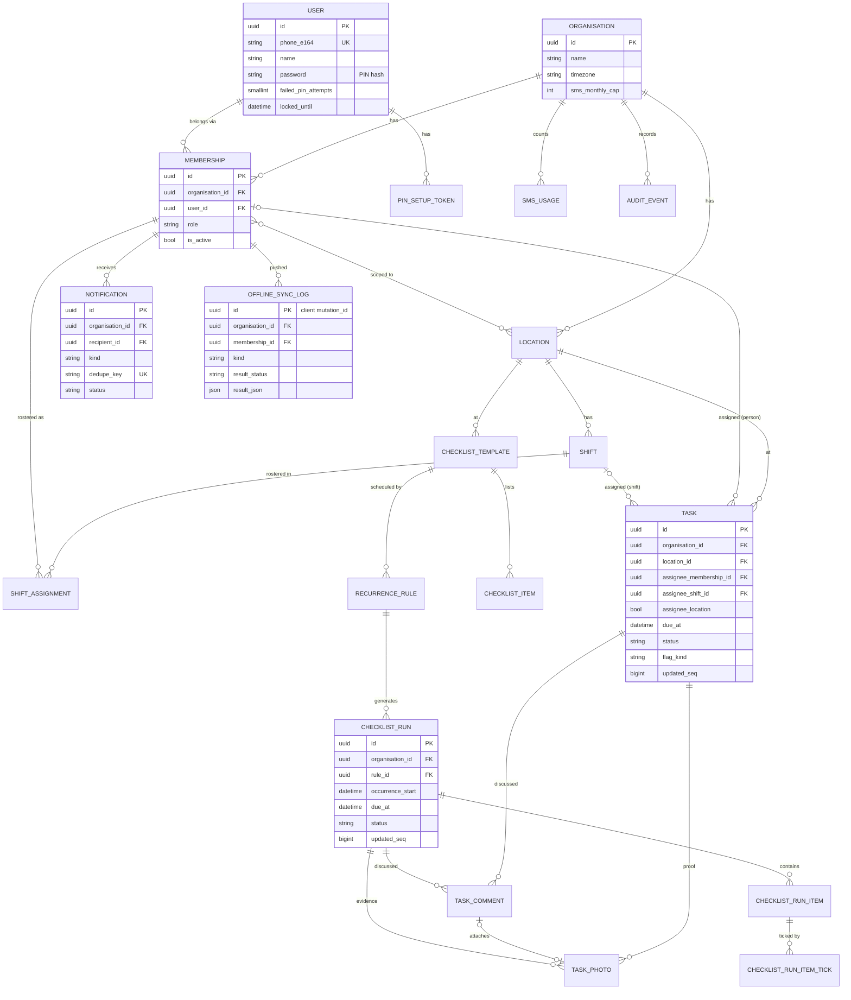
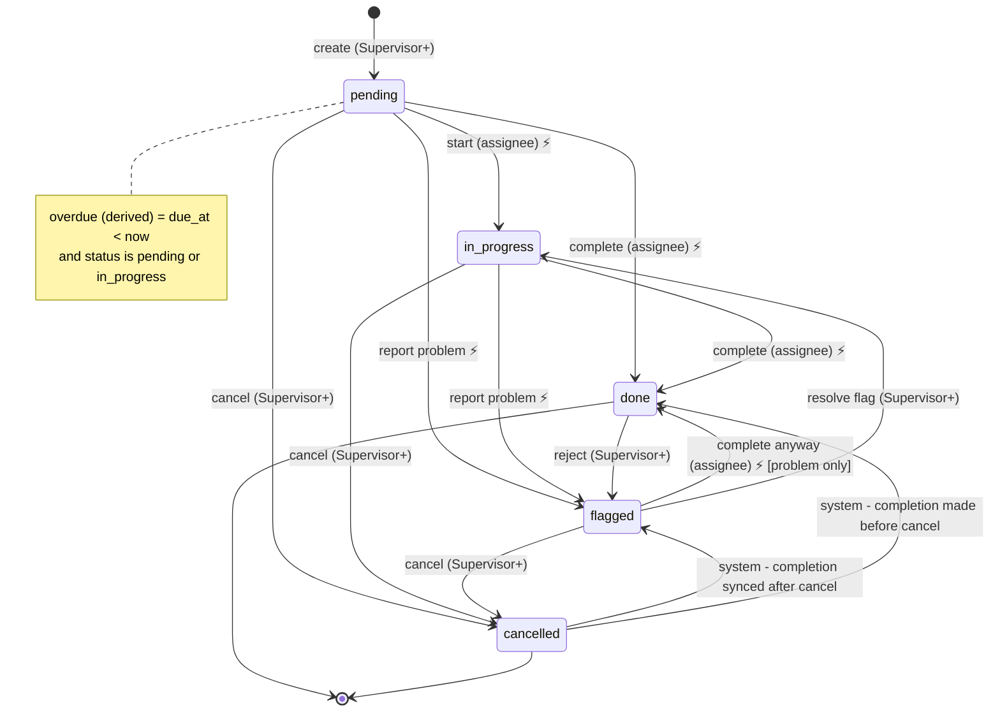

# 04 — Detailed design: WorkFlow MVP

Status: **Draft — awaiting approval before scaffolding** · Last updated: 2026-09-28
Builds on: [01-requirements.md](01-requirements.md) · [02-architecture.md](02-architecture.md) · [03-decisions.md](03-decisions.md)

Where this document and 01/02 disagree on detail, **this document wins** (01/02 have been updated to
match). Main changes: the task states are `pending / in_progress / done / flagged / cancelled` with
overdue **derived** ([ADR-17](03-decisions.md#adr-17--overdue-is-derived-not-stored)), and the
Django project and app names follow the scaffold brief.

**Project package:** `workflow/`. **Apps:** `accounts`, `organisations`, `tasks`, `checklists`,
`notifications`, `dashboard`, `sync`.

| App | Owns |
|-----|------|
| `accounts` | `User`, `PinSetupToken`, PIN auth backend, lockout, phone normalisation |
| `organisations` | `Organisation`, `Location`, `Membership`, `Shift`, `ShiftAssignment`, `AuditEvent`; **tenancy core** (`tenancy.py`, `middleware.py`, `permissions.py`) |
| `tasks` | `Task`, `TaskPhoto`, `TaskComment`, state machine (`transitions.py`) |
| `checklists` | `ChecklistTemplate`, `ChecklistItem`, `RecurrenceRule`, `ChecklistRun`, `ChecklistRunItem`, `ChecklistRunItemTick`, run generator |
| `notifications` | `Notification`, `SmsUsage`, backends, dispatch, SMS templates |
| `dashboard` | No models. Aggregate queries + HTMX views |
| `sync` | `OfflineSyncLog`, DRF pull/push/photo endpoints, mutation handlers |

---

## 1. Data model

### 1.1 Base classes

```python
# organisations/tenancy.py (sketch)
class TenantModel(models.Model):          # abstract
    id = UUIDField(primary_key=True, default=uuid4, editable=False)
    organisation = ForeignKey("organisations.Organisation", on_delete=PROTECT, db_index=False)
    created_at = DateTimeField(auto_now_add=True)
    updated_at = DateTimeField(auto_now=True)
    objects = TenantScopedManager()        # filters by current_org; raises TenantNotSet if unset
    unscoped = models.Manager()            # system code only (lint-checked)
    class Meta: abstract = True

class SyncedTenantModel(TenantModel):     # abstract — rows that phones pull
    updated_seq = BigIntegerField(editable=False, db_index=False)   # set by DB trigger
    deleted_at = DateTimeField(null=True, blank=True)               # soft delete → tombstone
    class Meta:
        abstract = True
        # each concrete model adds Index(fields=["organisation", "updated_seq"])
```

- **`updated_seq`** is set by a PostgreSQL trigger `BEFORE INSERT OR UPDATE … SET NEW.updated_seq =
  nextval('workflow_updated_seq')` on every synced table. The trigger is installed by a migration
  helper (`sync.migrations_utils.install_seq_trigger(table)`). A trigger, unlike `save()`, also
  catches `QuerySet.update()`.
- The first index column is `organisation` everywhere, because every query filters on it.
- `on_delete=PROTECT` on `organisation`: organisations are deactivated, never cascade-deleted.
- "Tenant-scoped = ✅" below means the model inherits `TenantModel` or `SyncedTenantModel`.
  "Synced = ✅" means `SyncedTenantModel`.

### 1.2 Models

Types are Django field types. `→` means ForeignKey (with its `on_delete`). "Choices" are
`TextChoices`.

#### `accounts.User` — Global (not tenant-scoped)
Subclasses `AbstractBaseUser` + `PermissionsMixin`. `USERNAME_FIELD = "phone_e164"`.

| Field | Type | Notes |
|-------|------|-------|
| id | UUIDField PK | |
| phone_e164 | CharField(16) unique | Normalised `+2567XXXXXXXX`; validated by `accounts.phone.normalise()` |
| name | CharField(80) | |
| password | (inherited) | **PIN hash** (Django hashers) |
| must_set_pin | BooleanField default True | Forces the PIN setup screen |
| failed_pin_attempts | PositiveSmallIntegerField default 0 | Reset on success |
| locked_until | DateTimeField null | Set after 5 failures (+15 min) |
| preferred_channel | Choices `sms`/`whatsapp` default `sms` | |
| reminders_opt_out | BooleanField default False | Opts out of F5.1 reminders only |
| is_active, is_staff, is_superuser, last_login, date_joined | standard | `is_staff` = Django admin (operator only) |

#### `accounts.PinSetupToken` — Global

| Field | Type | Notes |
|-------|------|-------|
| id | UUID PK | |
| user | → User CASCADE | |
| code_hash | CharField(128) | 6-digit code, hashed; sent by SMS |
| expires_at | DateTimeField | +24 h |
| used_at | DateTimeField null | |
| created_by | → User SET_NULL null | The manager who triggered the reset |

Index: `(user, expires_at)`.

#### `organisations.Organisation` — Global (it *is* the tenant)

| Field | Type | Notes |
|-------|------|-------|
| id | UUID PK | |
| name | CharField(120) | |
| slug | SlugField unique | |
| timezone | CharField(64) default `Africa/Kampala` | Validated against `zoneinfo` |
| country_code | CharField(2) default `UG` | Used for phone normalisation |
| is_active | BooleanField default True | |
| photo_required_default | BooleanField default True | |
| default_reminder_lead_min | PositiveSmallIntegerField default 30 | 0 = off |
| escalation_delay_min | PositiveSmallIntegerField default 30 | |
| quiet_hours_start / quiet_hours_end | TimeField default 22:00 / 06:00 | |
| sms_monthly_cap | PositiveIntegerField default 1000 | |
| daily_summary_time | TimeField null | null = off |
| photo_retention_days | PositiveSmallIntegerField default 90 | |
| record_retention_days | PositiveSmallIntegerField default 730 | |
| created_at | DateTimeField | |

#### `organisations.Location` — Tenant-scoped ✅ · Synced ✅

| Field | Type | Notes |
|-------|------|-------|
| name | CharField(80) | |
| is_active | BooleanField default True | |
| sort_order | PositiveSmallIntegerField default 0 | |

Constraint: unique `(organisation, name)`. Index: `(organisation, updated_seq)`.

#### `organisations.Membership` — Tenant-scoped ✅ · Synced ✅ (as a "people" projection: id, name, role)

| Field | Type | Notes |
|-------|------|-------|
| user | → User PROTECT | |
| role | Choices `owner`/`manager`/`supervisor`/`staff` | |
| is_active | BooleanField default True | Inactive = cannot log in to this organisation |
| locations | ManyToMany → Location (through `MembershipLocation`, tenant-scoped) | Scope for managers and supervisors. Empty = all locations (for supervisors too) |
| display_name | CharField(80) blank | Overrides `user.name` in this organisation (optional) |

Constraint: unique `(organisation, user)`. Index: `(organisation, role)`,
`(organisation, updated_seq)`.

#### `organisations.Shift` — Tenant-scoped ✅ · Synced ✅

| Field | Type | Notes |
|-------|------|-------|
| location | → Location PROTECT | |
| name | CharField(60) | "Morning" |
| start_time / end_time | TimeField | `end_time <= start_time` ⇒ crosses midnight |
| weekdays | ArrayField(PositiveSmallIntegerField) | 0 = Mon … 6 = Sun. The days this shift normally runs |
| is_active | BooleanField default True | |

Constraint: unique `(organisation, location, name)`. Index: `(organisation, updated_seq)`.

#### `organisations.ShiftAssignment` (roster entry) — Tenant-scoped ✅ · Synced ✅

| Field | Type | Notes |
|-------|------|-------|
| shift | → Shift CASCADE | |
| membership | → Membership CASCADE | |
| date | DateField | The local date the shift **starts** |

Constraint: unique `(shift, membership, date)`. Indexes: `(organisation, date)`,
`(organisation, membership, date)`, `(organisation, updated_seq)`.

#### `organisations.AuditEvent` — Tenant-scoped ✅ · not synced

| Field | Type | Notes |
|-------|------|-------|
| actor | → Membership SET_NULL null | null = system |
| action | CharField(40) | e.g. `task.cancel`, `membership.role_change`, `pin.reset` |
| target_type | CharField(40) | |
| target_id | UUIDField | |
| changes | JSONField default dict | `{field: [old, new]}` — never PINs or phone numbers |

Index: `(organisation, created_at)`, `(organisation, target_type, target_id)`.

#### `tasks.Task` — Tenant-scoped ✅ · Synced ✅

| Field | Type | Notes |
|-------|------|-------|
| title | CharField(120) | |
| description | TextField(max 1000) blank | |
| location | → Location PROTECT | Always set (used for grouping) |
| assignee_membership | → Membership PROTECT null | Exactly one assignee is set (see constraint) |
| assignee_shift | → Shift PROTECT null | |
| assignee_location | BooleanField default False | True = "anyone rostered at `location` that day" |
| shift_date | DateField null | Required when `assignee_shift` is set |
| due_at | DateTimeField | UTC |
| status | Choices `pending`/`in_progress`/`done`/`flagged`/`cancelled` default `pending` | See §5 |
| photo_required | BooleanField | Defaults from the organisation |
| reminder_lead_min | PositiveSmallIntegerField null | null = organisation default |
| created_by | → Membership PROTECT | |
| started_by | → Membership SET_NULL null | |
| completed_by | → Membership SET_NULL null | |
| completed_at_device | DateTimeField null | Device clock, as sent |
| completed_at_trusted | DateTimeField null | Derived (02 §4.6). Used for on-time and late |
| completed_received_at | DateTimeField null | Server clock |
| due_at_when_completed | DateTimeField null | Snapshot for fair on-time/late judgement |
| time_untrusted | BooleanField default False | |
| flag_kind | Choices `problem`/`rejected`/`completed_after_cancel` null | Set while `status=flagged` |
| flag_reason | CharField(300) blank | |
| flagged_by | → Membership SET_NULL null | |
| flag_resolved_note | CharField(300) blank | Kept after the flag is resolved |
| cancelled_by | → Membership SET_NULL null | |

Constraints:
- `CheckConstraint`: exactly one of `assignee_membership IS NOT NULL`, `assignee_shift IS NOT NULL`,
  `assignee_location = true`.
- `CheckConstraint`: `assignee_shift IS NULL OR shift_date IS NOT NULL`.
- `CheckConstraint`: `status <> 'flagged' OR flag_kind IS NOT NULL`.

Indexes: `(organisation, status, due_at)`, `(organisation, location, due_at)`,
`(organisation, assignee_membership, due_at)`, `(organisation, assignee_shift, shift_date)`,
`(organisation, updated_seq)`.

#### `tasks.TaskPhoto` — Tenant-scoped ✅ · Synced ✅ (metadata only; the image comes from `/media/p/<id>`)
This is the **single photo table**. It holds task proof photos, checklist tick photos and comment
photos. The client generates the `id` and uploads the file **before** the mutation that references
it.

| Field | Type | Notes |
|-------|------|-------|
| task | → Task CASCADE null | Linked when the mutation is applied |
| checklist_run | → checklists.ChecklistRun CASCADE null | |
| file | CharField(200) | Relative path `org/<org>/photos/<id>.jpg` |
| thumb | CharField(200) | `…/<id>_t.jpg` |
| bytes | PositiveIntegerField | |
| sha256 | CharField(64) | Makes re-uploads idempotent |
| width / height | PositiveSmallIntegerField | |
| taken_at_device | DateTimeField null | |
| uploaded_by | → Membership PROTECT | |
| linked_at | DateTimeField null | null after 7 days ⇒ orphan cleanup |

Index: `(organisation, task)`, `(organisation, linked_at)`, `(organisation, updated_seq)`.

#### `tasks.TaskComment` — Tenant-scoped ✅ · Synced ✅
Comments on a task **or** a checklist run. A flag raised by staff is a comment with `is_flag=True`.

| Field | Type | Notes |
|-------|------|-------|
| task | → Task CASCADE null | Exactly one of task / checklist_run |
| checklist_run | → ChecklistRun CASCADE null | |
| author | → Membership PROTECT | |
| body | CharField(500) | |
| photo | → TaskPhoto SET_NULL null | |
| is_flag | BooleanField default False | |
| device_time | DateTimeField | Ordering: `device_time`, then `created_at` |
| hidden_by | → Membership SET_NULL null | Moderated by a manager. Rendered as a placeholder |
| deleted_at | (inherited) | Author self-delete ≤ 5 min |

Constraint: `CheckConstraint` exactly one of `task`, `checklist_run`. Index:
`(organisation, task, device_time)`, `(organisation, checklist_run, device_time)`,
`(organisation, updated_seq)`.

#### `checklists.ChecklistTemplate` — Tenant-scoped ✅ · not synced

| Field | Type | Notes |
|-------|------|-------|
| name | CharField(120) | |
| location | → Location PROTECT | |
| shift | → Shift SET_NULL null | Runs are assigned to this shift, or else to the location |
| is_active | BooleanField default True | |
| created_by | → Membership PROTECT | |

Unique `(organisation, location, name)`.

#### `checklists.ChecklistItem` — Tenant-scoped ✅ · not synced

| Field | Type | Notes |
|-------|------|-------|
| template | → ChecklistTemplate CASCADE | |
| order | PositiveSmallIntegerField | |
| label | CharField(160) | |
| photo_required | BooleanField default False | |
| skippable | BooleanField default True | False = "must not be skipped" |
| is_active | BooleanField default True | Soft-remove without changing past runs |

Unique `(template, order)` (deferrable, so items can be reordered in one transaction).

#### `checklists.RecurrenceRule` — Tenant-scoped ✅ · not synced

| Field | Type | Notes |
|-------|------|-------|
| template | → ChecklistTemplate CASCADE | |
| kind | Choices `daily`/`weekly`/`shift_start` | |
| times | ArrayField(TimeField) | Local times. Not used for `shift_start` |
| weekdays | ArrayField(PositiveSmallIntegerField) | For `weekly` (0 = Mon) |
| available_before_min | PositiveSmallIntegerField default 0 | How long before the occurrence the run shows as "now" |
| due_offset_min | PositiveSmallIntegerField default 60 | `due_at = occurrence_start + offset` |
| starts_on | DateField | |
| ends_on | DateField null | |
| is_active | BooleanField default True | |

Check: `kind <> 'weekly' OR cardinality(weekdays) > 0`; `kind = 'shift_start' OR cardinality(times) > 0`.

#### `checklists.ChecklistRun` — Tenant-scoped ✅ · Synced ✅

| Field | Type | Notes |
|-------|------|-------|
| template | → ChecklistTemplate PROTECT | |
| rule | → RecurrenceRule SET_NULL null | |
| name | CharField(120) | Copied from the template |
| location | → Location PROTECT | Copied |
| shift | → Shift SET_NULL null | Copied |
| shift_date | DateField null | |
| occurrence_start | DateTimeField | UTC |
| due_at | DateTimeField | UTC |
| status | Choices `pending`/`in_progress`/`done`/`flagged`/`cancelled` | §5.4 |
| completed_at_trusted | DateTimeField null | |

Constraint: unique `(rule, occurrence_start)`, which makes generation idempotent. Indexes:
`(organisation, status, due_at)`, `(organisation, location, due_at)`,
`(organisation, updated_seq)`.

#### `checklists.ChecklistRunItem` — Tenant-scoped ✅ · Synced ✅
Copied from `ChecklistItem` when the run is generated.

| Field | Type |
|-------|------|
| run | → ChecklistRun CASCADE |
| order | PositiveSmallIntegerField |
| label | CharField(160) |
| photo_required | BooleanField |
| skippable | BooleanField |

Unique `(run, order)`. Index `(organisation, updated_seq)`.

#### `checklists.ChecklistRunItemTick` — Tenant-scoped ✅ · Synced ✅ · append-only

| Field | Type | Notes |
|-------|------|-------|
| run_item | → ChecklistRunItem CASCADE | |
| membership | → Membership PROTECT | |
| skipped | BooleanField default False | |
| skip_reason | CharField(200) blank | Required if skipped |
| photo | → TaskPhoto SET_NULL null | |
| device_time | DateTimeField | |
| trusted_time | DateTimeField | |

The item's effective tick is the one with the **earliest `trusted_time`**. Index:
`(organisation, run_item, trusted_time)`, `(organisation, updated_seq)`.

#### `notifications.Notification` — Tenant-scoped ✅ · not synced
Records both the intent to notify someone and the delivery log.

| Field | Type | Notes |
|-------|------|-------|
| recipient | → Membership CASCADE | |
| to_e164 | CharField(16) | Snapshot at send time |
| channel | Choices `sms`/`whatsapp` | |
| kind | Choices `reminder`/`overdue`/`escalation`/`flag`/`rejected`/`synced_late`/`daily_summary`/`pin_setup` | |
| target_type | CharField(20) blank | `task` / `run` |
| target_id | UUIDField null | |
| step | PositiveSmallIntegerField default 0 | Escalation step (0 assignee, 1 supervisor, 2 manager) |
| body | CharField(160) | |
| dedupe_key | CharField(120) **unique** | e.g. `overdue:task:<id>:1:<membership>` |
| status | Choices `queued`/`held`/`sent`/`failed`/`suppressed` | `held` = quiet hours; `suppressed` = opt-out, budget or already done |
| send_after | DateTimeField | |
| attempts | PositiveSmallIntegerField default 0 | |
| provider_message_id | CharField(80) blank | |
| cost | DecimalField(8,4) null | |
| error | CharField(300) blank | |
| sent_at | DateTimeField null | |

Indexes: `(status, send_after)` (dispatcher, all organisations, using the `unscoped` manager),
`(organisation, created_at)`, `(organisation, target_type, target_id)`.

#### `notifications.SmsUsage` — Tenant-scoped ✅ · not synced

| Field | Type |
|-------|------|
| month | DateField (first day of the month) |
| count | PositiveIntegerField |
| warned_80 | BooleanField |

Unique `(organisation, month)`. Incremented with `F("count") + 1`.

#### `sync.OfflineSyncLog` — Tenant-scoped ✅ · not synced
The idempotency record. **`id` = the client's `mutation_id`.**

| Field | Type | Notes |
|-------|------|-------|
| id | UUID PK | Client-generated `mutation_id` |
| membership | → Membership CASCADE | |
| device_id | UUIDField | One per app install. For debugging only |
| kind | CharField(30) | e.g. `task.complete` |
| device_time | DateTimeField | |
| received_at | DateTimeField auto | |
| result_status | Choices `applied`/`rejected` | Duplicates are *returned* as `duplicate`, not stored again |
| result_code | CharField(40) blank | Reason or warning code |
| result_json | JSONField | The exact response item returned the first time |

Index: `(organisation, received_at)` for purging after 30 days.

#### `organisations.MemberActivity` — Tenant-scoped ✅ · not synced (ADR-21)
Kept off `Membership` so activity writes don't bump `updated_seq`.

| Field | Type | Notes |
|-------|------|-------|
| membership | OneToOne → Membership CASCADE | Same organisation (checked in `save()`) |
| last_seen_at | DateTimeField null | Set by `OrganisationMiddleware`, at most once a minute per session |
| notifications_seen_at | DateTimeField null | Set when the bell's list is opened |

### 1.3 ER diagram



---

## 2. Permission matrix

**Scopes:**
- **all:** the whole organisation.
- **locs:** the membership's linked locations. For a Manager or Supervisor with none linked, this
  means all (implemented in `Task.objects.visible_to()`; tasks can also only be *created* at
  linked locations).
- **mine:** tasks and runs assigned to me, plus those assigned to a shift or location I am
  rostered on for that date.

Each action is one function in `organisations/permissions.py`:
`can(membership, action, obj=None) -> bool`. List views use a matching
`visible_to(membership)` queryset.

| Action (helper key) | Owner | Manager | Supervisor | Staff | Offline? |
|---------------------|:-----:|:-------:|:----------:|:-----:|:--------:|
| `org.settings.edit` | all | — | — | — | — |
| `membership.invite` / `.deactivate` | all | locs, not Owners | — | — | — |
| `membership.change_role` | all | locs, up to Supervisor | — | — | — |
| `pin.reset` | all | locs | locs, Staff only | — | — |
| `location.manage`, `shift.manage` | all | locs | — | — | — |
| `roster.view` | all | locs | locs | own shifts | ✅ (own) |
| `roster.edit` | all | locs | — | — | — |
| `template.manage` (templates, items, rules) | all | locs | — | — | — |
| `task.view` | all | locs | locs | mine | ✅ (mine) |
| `task.create` / `task.edit` | all | locs | locs | — | — |
| `task.cancel` | all | locs | locs | — | — |
| `task.start` / `task.complete` | all | locs | locs | mine | ✅ |
| `task.flag` (raise a problem) | all | locs | locs | mine | ✅ |
| `task.reject` (done → flagged) | all | locs | locs | — | — |
| `task.resolve_flag` | all | locs | locs | — | — |
| `run.view` | all | locs | locs | mine | ✅ (mine) |
| `run.tick` / `run.skip` | all | locs | locs | mine | ✅ |
| `run.flag` (report a problem) | all | locs | locs | mine | ✅ |
| `run.resolve_flag` | all | locs | locs | — | — |
| `run.cancel` | all | locs | locs | — | — |
| `comment.add` | on visible | on visible | on visible | on visible | ✅ |
| `comment.delete_own` (≤ 5 min) | ✅ | ✅ | ✅ | ✅ | ✅ |
| `comment.hide` | all | locs | — | — | — |
| `photo.view` | all | locs | locs | on visible tasks | ✅ (cached) |
| `dashboard.view` | all | locs | locs | — | — |
| `notification.settings` | all | locs (own prefs + defaults) | own prefs | own prefs | — |
| `audit.view` | all | — | — | — | — |
| `user.export_or_anonymise` | all | — | — | — | — |

Rules:
- Every check first confirms that the object's `organisation` equals `request.organisation`.
  This is the tenancy guard; the role check comes after it.
- A Supervisor who is *also* rostered on a shift gets "mine" permissions for that shift.
  The two scopes are combined.
- Denied access to an object that exists **in the same organisation** → 403. An object from
  another organisation → 404, so the response never confirms that it exists.

---

## 3. Screens and wireframes

These are mobile-first wireframes at 360 px wide. **Field app** screens are rendered by Alpine
from Dexie and work offline. **HTMX** screens are server-rendered and need a connection.

| # | Screen | URL | Renderer | Offline |
|---|--------|-----|----------|:-------:|
| S1 | Login (phone + PIN) | `/login/` | Django | — |
| S2 | Set PIN (first login / reset) | `/pin/setup/` | Django | — |
| S3 | Organisation picker | `/org/switch/` | Django | — |
| S4 | Staff "My tasks today" | `/app/#/` | Field app | ✅ |
| S5 | Task detail + photo capture + flag | `/app/#/task/<id>` | Field app | ✅ |
| S6 | Checklist run | `/app/#/run/<id>` | Field app | ✅ |
| S7 | Manager dashboard | `/dashboard/` | HTMX | — (cached last view) |
| S8 | Task assignment (create/edit) | `/tasks/new/` | HTMX | — |
| S9 | Weekly roster | `/roster/?week=2026-W40` | HTMX | — |

Shared elements on field app screens: a top bar with the organisation name and a **sync
badge**, and a bottom tab bar (Tasks · Shifts · Me). The sync badge shows one of:
- `✓ Synced 10:42`
- `⟳ 3 waiting` (amber)
- `⚠ Sync problem`, tappable to see details (red)
- `⚡ Offline`

### S1 — Login

```
┌────────────────────────────────────┐
│            ◉ WorkFlow              │
│                                    │
│  Phone number                      │
│  ┌──────────────────────────────┐  │
│  │ 🇺🇬 +256 │ 772 123 456         │  │
│  └──────────────────────────────┘  │
│  PIN                               │
│        ●   ●   ○   ○               │
│  ┌────────┬────────┬────────┐      │
│  │   1    │   2    │   3    │      │
│  ├────────┼────────┼────────┤      │
│  │   4    │   5    │   6    │      │
│  ├────────┼────────┼────────┤      │
│  │   7    │   8    │   9    │      │
│  ├────────┼────────┼────────┤      │
│  │   ⌫    │   0    │   →    │      │
│  └────────┴────────┴────────┘      │
│  Forgot PIN? Ask your supervisor.  │
│  ⚠ Wrong PIN. 2 tries left.        │  ← error area (aria-live)
└────────────────────────────────────┘
```
- The phone field accepts `0772…`, `772…` or `+256772…` and normalises it on the server.
- The on-screen keypad is plain HTML buttons, with `inputmode="numeric"` as a fallback.
- It submits automatically once the PIN length is reached (4 for staff; 4–6 for other roles, Q4).
- If the account is locked: "Too many tries. Try again at 10:57 or ask your supervisor."

### S4 — Staff "My tasks today"

```
┌────────────────────────────────────┐
│ Demo Guest House      ⟳ 2 waiting  │
│ Tue 14 Oct · Morning shift (Main)  │
├────────────────────────────────────┤
│ OVERDUE (1)                        │
│ ┌────────────────────────────────┐ │
│ │ 🔴 Clean Room 12          09:30 │ │
│ │    Main · you · 📷 required     │ │
│ └────────────────────────────────┘ │
│ NOW (2)                            │
│ ┌────────────────────────────────┐ │
│ │ ☐ Opening checklist — Bar 10:00│ │
│ │    4 / 9 done · Morning shift   │ │
│ ├────────────────────────────────┤ │
│ │ ◐ Restock towels         10:30 │ │
│ │    Laundry · in progress        │ │
│ └────────────────────────────────┘ │
│ LATER TODAY (3)                    │
│ │ ○ Check pool chemicals   14:00 │ │
│ │ ...                             │ │
│ DONE TODAY (5)              [show] │
├────────────────────────────────────┤
│   ☑ Tasks     📅 Shifts     👤 Me   │
└────────────────────────────────────┘
```
- Items are grouped into **Overdue** (derived: `due_at < now`, not done or cancelled), **Now**
  (due within 2 h), **Later today**, **Tomorrow**, and **Done today** (collapsed). Checklist runs
  and tasks are mixed together and sorted by due time.
- Items waiting to sync show a small ⟳ icon on the row.
- There is no pull-to-refresh. Sync runs automatically (02 §4.4), and the "Me" tab has a
  **Sync now** button.

### S5 — Task detail with photo capture

```
┌────────────────────────────────────┐
│ ← Back                ✓ Synced     │
├────────────────────────────────────┤
│ Clean Room 12                      │
│ 🔴 Overdue · due 09:30 (40 min ago) │
│ 📍 Main building · 👤 You            │
│ Change sheets, restock toiletries, │
│ check minibar.                     │
├────────────────────────────────────┤
│ PROOF PHOTO (required)             │
│ ┌──────────┐                       │
│ │  [thumb] │  ✕ remove             │
│ └──────────┘                       │
│ ┌────────────────────────────────┐ │
│ │        📷  Take photo           │ │
│ └────────────────────────────────┘ │
├────────────────────────────────────┤
│ ┌──────────────┐ ┌───────────────┐ │
│ │ ▶ Start      │ │ ✔ Mark done   │ │  ← big buttons
│ └──────────────┘ └───────────────┘ │
│ ┌────────────────────────────────┐ │
│ │ ⚑ Report a problem              │ │
│ └────────────────────────────────┘ │
├────────────────────────────────────┤
│ COMMENTS (2)                       │
│ Aisha (Sup) 09:41: Guest checks in │
│   at 12, please prioritise.        │
│ You 09:50 ⟳: On it now.            │
│ ┌──────────────────────────┐ [Send]│
│ │ Write a comment…         │       │
│ └──────────────────────────┘       │
└────────────────────────────────────┘
```
- **Take photo:** `<input type="file" accept="image/*" capture="environment">`. The photo is
  compressed on the device (02 §8) and the thumbnail appears immediately.
- **Mark done** is disabled until there is a photo when one is required. A hint says why.
- **Report a problem** opens a bottom sheet with a reason list (per organisation: "No
  supplies", "Room occupied", "Broken equipment", "Other…"), an optional note and an optional
  photo. Submitting sets the task to `flagged` and adds an `is_flag` comment.
- If the task is `flagged`, a banner shows the reason and "Waiting for supervisor". The staff
  member can still mark it done (§5).

### S6 — Checklist run

```
┌────────────────────────────────────┐
│ ← Back                ⟳ 1 waiting  │
├────────────────────────────────────┤
│ Opening checklist — Bar            │
│ Due 10:00 · Morning shift · Main   │
│ ▓▓▓▓▓▓▓░░░░░░  4 / 9               │
├────────────────────────────────────┤
│ ☑ 1. Unlock stores       Peter 07:02│
│ ☑ 2. Fridges ≤ 5°C  📷   Peter 07:05│
│ ⤼ 3. Ice machine on — skipped:     │
│      "Machine broken" · Peter      │
│ ☐ 4. Count float (UGX)          📷 │
│      ┌──────────┐ ┌─────────────┐  │
│      │ ✔ Done   │ │ ⤼ Skip…     │  │
│      └──────────┘ └─────────────┘  │
│ ☐ 5. Wipe counters                 │
│ ☐ 6. …                             │
├────────────────────────────────────┤
│ ⚑ Report a problem    💬 Comments 1 │
└────────────────────────────────────┘
```
- Tapping a row expands its **Done / Skip** buttons. Items marked 📷 open the camera first.
- "Skip…" asks for a reason. It is hidden for items that must not be skipped.
- The run moves to `done` or `flagged` automatically when every item is resolved (§5.4).
  There is no "submit" button.

### S7 — Manager dashboard

```
┌────────────────────────────────────┐
│ Demo Guest House ▾        Manager  │
│ [Today ▾]  [All locations ▾]  ⟳    │
├────────────────────────────────────┤
│ ┌───────┐┌───────┐┌───────┐┌─────┐ │
│ │  42   ││   3   ││   2   ││ 11  │ │
│ │ Done  ││Overdue││Flagged││Open │ │
│ │ 1 late││       ││       ││     │ │
│ └───────┘└───────┘└───────┘└─────┘ │
│ Group by: (•)Staff ( )Shift ( )Loc │
├────────────────────────────────────┤
│ Name        Done  Over  Flag  Open │
│ Peter O.      12    2 ●    1     3 │
│ Grace N.      10    0      0     2 │
│ Morning (sh)   8    1      1     4 │
│ …                                  │
├────────────────────────────────────┤
│ ⚠ 1 SMS failed · Last backup 02:00 │
│ Updated 10:44 · auto-refresh 60 s  │
└────────────────────────────────────┘
```
- Changing the filters or "Group by" makes an HTMX request (`hx-get` →
  `/dashboard/partials/summary`) that swaps the cards and table. The dashboard also polls every
  60 s (`hx-trigger="every 60s"`) while the tab is visible.
- Tapping a count tile opens `/dashboard/list?bucket=&range=&loc=`, a plain list of the tasks and
  runs in that bucket. (Built: tiles drill down; the breakdown table's cells are plain numbers — a
  per-row drill-down is a possible follow-up.)
- **Breakdown attribution** (`dashboard/queries.py`): by staff, finished work is credited to
  whoever completed it and open work to the assigned person; shift/location tasks nobody has
  claimed yet, and checklist runs (usually a team's), get their own rows. By shift, work not tied
  to a shift is "Not on a shift".
- **Overdue list** (below the tiles): the period's overdue tasks and runs. Tasks have a one-tap
  reassign to one person (`POST /dashboard/reassign/<task>/`, people on shift today first,
  audited as `task.edit`); runs link to the run.
- **Trends**: 7- and 30-day completion rate (done ÷ everything due, cancelled excluded; with the
  on-time share) as stat tiles, and a 30-day column chart — server-rendered SVG, one hue, days
  with nothing due left as gaps, a table view. Today is left out (it isn't over).
- All numbers come from a fixed number of aggregate queries whatever the data size
  (`tests/test_dashboard.py` caps the page at 25 queries).
- The buckets do not overlap (§5.3): each task or run is counted in exactly one of Done,
  Overdue, Flagged or Open. Cancelled items are excluded. The "late" subtext counts done items
  whose trusted completion time was after the due time.
- On wide screens the cards sit in one row and the table is wider. It is the same template.

### S8 — Task assignment (create / edit)

```
┌────────────────────────────────────┐
│ ← Tasks          New task          │
├────────────────────────────────────┤
│ Title *                            │
│ ┌────────────────────────────────┐ │
│ │ Clean Room 12                  │ │
│ └────────────────────────────────┘ │
│ Details                            │
│ ┌────────────────────────────────┐ │
│ │                                │ │
│ └────────────────────────────────┘ │
│ Location *   [Main building    ▾]  │
│ Assign to *                        │
│  (•) Person  [Peter Okello     ▾]  │
│  ( ) Shift   [Morning  ▾] [14 Oct] │
│  ( ) Anyone at this location       │
│ Due *        [14 Oct] [09:30]      │
│ ☑ Photo required                   │
│ Reminder     [30 min before ▾]     │
├────────────────────────────────────┤
│ ┌────────────────────────────────┐ │
│ │           Save task             │ │
│ └────────────────────────────────┘ │
└────────────────────────────────────┘
```
- Changing the location refreshes the Person and Shift lists by HTMX
  (`hx-get=/tasks/partials/assignees?location=`). The lists show only staff and shifts at that
  location, and people rostered that day are shown first, marked "on shift".
- The server validates everything. Supervisors only see their own locations.
- Edit is the same form. Cancel is a separate button that asks for confirmation.

### S9 — Weekly roster

```
┌────────────────────────────────────┐
│ Roster · Main building ▾           │
│ ◀  Week 40 (29 Sep – 5 Oct)  ▶     │
│ [Copy last week]                   │
├──────────┬────┬────┬────┬────┬─────┤
│          │Mon │Tue │Wed │Thu │ … → │  ← horizontal scroll
├──────────┼────┼────┼────┼────┼─────┤
│ Morning  │ PO │ PO │ GN │ PO │     │
│ 06–14    │ GN │ AK │ AK │    │     │
│          │ +  │ +  │ +  │ +  │     │
├──────────┼────┼────┼────┼────┼─────┤
│ Evening  │ AK │ GN │ PO │ GN │     │
│ 14–22    │ +  │ +  │ +  │ +  │     │
├──────────┼────┼────┼────┼────┼─────┤
│ Night 🌙 │ JM │ JM │ JM │ JM │     │
│ 22–06    │ +  │ +  │ +  │ +  │     │
└──────────┴────┴────┴────┴────┴─────┘
 ⚠ PO is on overlapping shifts (Wed)
```
- Each cell shows staff initials. Tapping `+` opens a small picker (an HTMX partial) to add a
  person. Tapping a person's initials removes them from that cell, with an undo option.
- Every change `POST`s to `/roster/cell/` and the server re-renders only that cell.
- Only the first column stays fixed; the day columns scroll sideways. This is the only screen
  that scrolls horizontally, and it does so inside its own container, not the page.

### S2 / S3 (brief)
- **S2 Set PIN:** asks for the 6-digit SMS code, then the new PIN twice.
- **S3 Organisation picker:** a list of organisation names. Choosing one stores the active
  membership in the session.

---

## 4. URL map and sync API contract

### 4.1 HTML routes

| Path | Method | View / app | Role |
|------|--------|-----------|------|
| `/` | GET | redirects: Staff → `/app/`, others → `/dashboard/` | any |
| `/login/`, `/logout/` | GET/POST, POST | accounts | public, any |
| `/pin/setup/` | GET/POST | accounts | public (code + phone) |
| `/org/switch/` | GET/POST | organisations | logged in |
| `/app/` | GET | field app shell (static template, cacheable) | any member |
| `/dashboard/` | GET | dashboard | Supervisor+ |
| `/dashboard/partials/summary` | GET (HTMX) | dashboard: `?range=today&loc=&group=staff` | Supervisor+ |
| `/dashboard/list` | GET | drill-down: `?bucket=&range=&loc=` | Supervisor+ |
| `/dashboard/reassign/<uuid>/` | POST (HTMX) | one-tap reassign of an overdue task to one person | Supervisor+ with `task.edit` |
| `/tasks/my/` | GET | "My tasks today" — online version of S4, for every role. Staff land on the offline field app (`/app/`) from `/` | any member |
| `/tasks/` | GET | tasks list, filters `?bucket=&loc=&day=` (HTMX swaps the rows); `?view=board` shows the kanban board (F1.6) | Supervisor+ |
| `/tasks/new/`, `/tasks/<uuid>/edit/` | GET/POST | create; edit and reassign are the same form (done/cancelled → 409) | Supervisor+ |
| `/tasks/<uuid>/` | GET | task detail: status, actions, photos, comments | anyone the task is visible to |
| `/tasks/<uuid>/start/`, `/complete/`, `/flag/` | POST (HTMX) | transitions T2–T5 (HTMX returns the updated panel) | per §2 (Staff: "mine") |
| `/tasks/<uuid>/cancel/` | POST | tasks | Supervisor+ |
| `/tasks/<uuid>/reject/` | POST | tasks (done → flagged, reason required) | Supervisor+ |
| `/tasks/<uuid>/resolve-flag/` | POST | tasks | Supervisor+ |
| `/tasks/<uuid>/photos/` | POST (HTMX, multipart) | proof photo upload, re-encoded to ≤ 200 KB | whoever may complete it |
| `/tasks/<uuid>/comments/` | POST (HTMX) | tasks | any with `task.view` |
| `/tasks/<uuid>/comments/<uuid>/delete/` | POST (HTMX) | author only, within 5 minutes | author |
| `/tasks/partials/assignees` | GET (HTMX) | tasks | Supervisor+ |
| `/checklists/` | GET | template list | Manager+ |
| `/checklists/new/` | GET/POST | create a template (name, location, optional shift) | Manager+ |
| `/checklists/<uuid>/` | GET/POST | template editor: details, items, schedules | Manager+ |
| `/checklists/<uuid>/items/`, `…/items/<uuid>/move/`, `…/items/<uuid>/remove/` | POST (HTMX) | add / reorder / soft-remove items (runs already generated keep theirs) | Manager+ |
| `/checklists/<uuid>/rules/` | POST | add a schedule; generates its runs immediately | Manager+ |
| `/checklists/rules/<uuid>/toggle/` | POST | pause (cancels future untouched runs) / resume (generates) | Manager+ |
| `/checklists/runs/` | GET | a day's runs (`?day=`), by due day | Supervisor+ |
| `/checklists/runs/<uuid>/` | GET | run page (S6) | anyone the run is visible to |
| `/checklists/items/<uuid>/tick/`, `/skip/` | POST (HTMX; tick is multipart with an optional photo) | resolve one item | per §2 (Staff: "mine") |
| `/checklists/runs/<uuid>/flag/`, `/resolve-flag/`, `/cancel/` | POST (HTMX) | run transitions (§5.4) | per §2 |
| `/checklists/runs/<uuid>/comments/`, `…/comments/<uuid>/delete/` | POST (HTMX) | comments on a run | as for tasks |
| `/roster/` | GET | organisations (roster) `?week=&loc=` | Supervisor+ (read), Manager+ (edit) |
| `/roster/cell/` | POST (HTMX) | add or remove an assignment | Manager+ |
| `/roster/copy-week/` | POST | organisations | Manager+ |
| `/org/locations/`, `/org/shifts/` | GET/POST | organisations | Manager+ |
| `/org/people/`, `/org/people/invite/` | GET/POST | organisations | Manager+ |
| `/org/people/<uuid>/reset-pin/` | POST | accounts | Supervisor+ |
| `/org/settings/` | GET/POST | organisations | Owner |
| `/media/p/<uuid>` · `/media/p/<uuid>/t` | GET | tasks: permission check → `X-Accel-Redirect` header to Caddy (`MEDIA_X_ACCEL`), or streamed by Django in dev mode | per `photo.view` + task visibility |
| `/sw.js` | GET | static, header `Service-Worker-Allowed: /`, `Cache-Control: no-cache` | public |
| `/manifest.json`, `/offline/` | GET | static | public |
| `/setup/` · `/setup/root.crt` | GET | CA install page (the **only** plain-HTTP routes) | public |
| `/healthz` · `/healthz/ready` | GET | liveness · DB + Redis readiness | public (no data) |
| `/notifications/` | GET (HTMX) | the bell's list: my notifications, last 7 days (F5.6) | any member |
| `/notifications/seen/` | POST (HTMX) | marks my list as seen | any member |
| `/styleguide/` | GET | every UI component in every state, for visual QA (ADR-19) | any member |
| `/admin/` | — | Django admin, `is_staff` only (install operator) | operator |

### 4.2 Sync API — common rules

- **Base path:** `/api/sync/`. JSON is UTF-8. Timestamps are ISO-8601 in UTC (`Z`). IDs are
  UUIDv4 strings.
- **Auth:** Django session cookie. Requests that change data send the `X-CSRFToken` header. The
  active organisation is the session's active membership. **Clients never send an organisation
  ID.**
- **Headers sent by the client:** `X-Client-Version: <build hash>`, `X-Device-Id: <uuid>`
  (generated once per install and stored in Dexie `meta`).
- **Rate limits:** push 30/min, pull 60/min, photos 60/min, per membership. Exceeding them
  returns 429 with `Retry-After`.
- **Compression:** the response is compressed by Caddy (gzip/zstd). Request bodies are
  uncompressed JSON or binary JPEG.

**HTTP-level errors** (the whole request failed; nothing was applied):

| HTTP | `code` | When | Client action |
|------|--------|------|---------------|
| 400 | `bad_request` | Malformed JSON or schema error in the envelope | Log it and report the bug. Don't retry the same body |
| 401 | `not_authenticated` | The session expired | Keep the outbox and show the login screen |
| 403 | `csrf_failed` / `membership_inactive` | CSRF failure, or the membership was deactivated | Refresh the CSRF token and retry once / log out and clear local data |
| 404 | `not_found` | Unknown photo parent or endpoint | — |
| 409 | `photo_conflict` | The same photo UUID was uploaded with different bytes (sha256 mismatch) | Generate a new UUID and re-link |
| 413 | `too_large` | A push body over 256 KB or a photo over 350 KB | Split the batch / recompress |
| 415 | `unsupported_media_type` | A photo that is not `image/jpeg` | Recompress to JPEG |
| 426 | `client_outdated` | `X-Client-Version` is older than the minimum supported | Activate the new service worker and reload |
| 429 | `rate_limited` | — | Wait for `Retry-After` |
| 503 | `maintenance` | During restore or migrations | Back off exponentially |

Error body: `{"code": "rate_limited", "detail": "Human readable text"}`.

### 4.3 `GET /api/sync/me`
Called at app start when online. Response:
```json
{
  "membership": {"id": "…", "role": "staff", "name": "Peter Okello"},
  "organisation": {"id": "…", "name": "Demo Guest House", "timezone": "Africa/Kampala",
                   "flag_reasons": ["No supplies", "Room occupied", "Broken equipment"]},
  "server_time": "2026-10-14T07:42:10Z",
  "min_client_version": "a1b2c3",
  "window": {"days_back": 3, "days_ahead": 2}
}
```

### 4.4 `GET /api/sync/pull?cursor=<int>&limit=500`
- `cursor=0` (or missing) means a full pull of the current window.
- The response includes rows the membership may see (`visible_to`) with `updated_seq > cursor`,
  ordered by `updated_seq`, up to the safe high-water mark (02 §4.4, ADR-03).

```json
{
  "cursor": 918273,
  "has_more": false,
  "reset": false,
  "server_time": "2026-10-14T07:42:11Z",
  "changes": {
    "locations":         [{"id": "…", "name": "Main building"}],
    "people":            [{"id": "<membership id>", "name": "Aisha K.", "role": "supervisor"}],
    "shifts":            [{"id": "…", "location_id": "…", "name": "Morning", "start": "06:00", "end": "14:00"}],
    "shift_assignments": [{"id": "…", "shift_id": "…", "membership_id": "…", "date": "2026-10-14"}],
    "tasks": [{
      "id": "…", "title": "Clean Room 12", "description": "…", "location_id": "…",
      "assignee": {"type": "membership", "id": "…"},
      "due_at": "2026-10-14T06:30:00Z", "status": "pending", "photo_required": true,
      "completed_by": null, "completed_at": null, "flag": null
    }],
    "runs":           [{"id": "…", "name": "Opening checklist — Bar", "location_id": "…", "shift_id": "…",
                        "shift_date": "2026-10-14", "due_at": "…", "status": "in_progress"}],
    "run_items":      [{"id": "…", "run_id": "…", "order": 4, "label": "Count float", "photo_required": true, "skippable": false}],
    "run_item_ticks": [{"id": "…", "run_item_id": "…", "membership_id": "…", "skipped": false, "time": "…", "photo_id": "…"}],
    "comments":       [{"id": "…", "task_id": "…", "run_id": null, "author_id": "…", "body": "…",
                        "is_flag": false, "photo_id": null, "time": "…", "hidden": false}],
    "photos":         [{"id": "…", "task_id": "…", "run_id": null, "thumb_url": "/media/p/…/t", "url": "/media/p/…"}]
  },
  "tombstones": [{"type": "tasks", "id": "…"}]
}
```
- **Tombstones** are sent for soft-deleted comments **and** for tasks and runs changed since the
  cursor that this membership can no longer see (for example a task reassigned away from them).
- A task or run in the page comes with **all** its children (items, ticks, comments, photos),
  however old. A new roster row of the user's own brings that shift's tasks and runs with it.
- **`reset: true`** tells the client to wipe its read models (the outbox is kept) and pull again
  from `cursor=0`. The server sends it only when the cursor is ahead of the server (a restore
  from backup). Role or location-scope changes are healed by the phone's 6-hourly full pull
  (ADR-03).
- The page stops at the safe high-water mark: rows written in the last 10 s wait for the next
  pull (ADR-03).
- Rows that drop out of the time window are **not** tombstoned. The client removes them locally
  by date once they have no pending outbox entries.

### 4.5 `POST /api/sync/push`
Request (at most 100 mutations and 256 KB):
```json
{
  "device_id": "5b0e…",
  "mutations": [
    {"mutation_id": "c7f1…", "kind": "task.complete", "device_time": "2026-10-14T06:58:02Z",
     "payload": {"task_id": "…", "photo_id": "…"}},
    {"mutation_id": "d912…", "kind": "comment.add", "device_time": "2026-10-14T06:58:40Z",
     "payload": {"comment_id": "…", "task_id": "…", "body": "Done, sheets changed", "photo_id": null}}
  ]
}
```

Response (always HTTP 200 when the envelope is valid; one result per mutation, in order):
```json
{
  "server_time": "2026-10-14T07:42:12Z",
  "results": [
    {"mutation_id": "c7f1…", "status": "applied", "code": null,
     "record": {"type": "tasks", "id": "…", "status": "done", "updated_seq": 918301}},
    {"mutation_id": "d912…", "status": "duplicate", "code": null, "record": {"type": "comments", "id": "…"}}
  ]
}
```

**Mutation kinds and payloads** (a closed list; anything else → `rejected / unknown_kind`):

| kind | payload | Server effect |
|------|---------|---------------|
| `task.start` | `{task_id}` | `pending → in_progress`; sets `started_by` |
| `task.complete` | `{task_id, photo_id?}` | `pending/in_progress/flagged(problem) → done`; completion fields; links the photo |
| `task.flag` | `{task_id, reason, note?, photo_id?, comment_id}` | `pending/in_progress → flagged(problem)` + an `is_flag` comment with the client's `comment_id` |
| `run.item_tick` | `{tick_id, run_item_id, photo_id?}` | Appends a tick; the run becomes `in_progress`, or finishes (§5.4) |
| `run.item_skip` | `{tick_id, run_item_id, reason}` | Appends a skipped tick (rejected if the item isn't skippable) |
| `comment.add` | `{comment_id, task_id \| run_id, body, photo_id?, is_flag?: false}` | Inserts a comment. `run_id` + `is_flag` flags the run |
| `comment.delete` | `{comment_id}` | Soft-deletes if author = me and ≤ 5 min after `created_at` |

**Idempotency:**
- `mutation_id` is the key. Before applying a mutation, the server looks up `OfflineSyncLog(id =
  mutation_id)`. If it is found and belongs to the same membership, the stored `result_json` is
  returned with `status: "duplicate"`. If it belongs to another membership → `rejected /
  forbidden`.
- Each mutation runs in its own transaction, and the log row is written **in the same
  transaction**, so a crash can never apply a mutation without logging it, or log it without
  applying it.
- IDs created on the client (`comment_id`, `tick_id`, `photo_id`) are also primary keys, which
  gives a second layer of protection against duplicates.
- Mutations are applied in array order. One rejection does **not** stop the rest.

**Per-mutation `status` values:**
- `applied`: `code` may carry a **warning**.
- `duplicate`: already applied before.
- `rejected`: `code` gives the reason. The client removes it from the outbox and shows it to the
  user.
- `retry`: nothing was applied and **nothing was logged**: the mutation refers to a photo the
  server doesn't have yet (`photo_not_uploaded`). The client keeps it and sends it again after
  the next photo upload.

| code | status | Meaning | Client UX |
|------|--------|---------|-----------|
| `invalid_transition` | rejected | For example `task.start` on a `done` task | Quietly refresh the task |
| `photo_required` | rejected | Completion without a photo on a `photo_required` task or item | Reopen the task: "Add a photo" |
| `not_found` | rejected | The target doesn't exist or isn't visible | "This task was removed by your manager" |
| `forbidden` | rejected | Visible, but the role or scope doesn't allow this action | "You can't do that" |
| `validation_error` | rejected | Field errors (`"errors": {"reason": ["required"]}`) | Show the errors |
| `not_skippable` | rejected | Skip on a must-do item | Reopen the item |
| `comment_edit_window_closed` | rejected | Delete after 5 min | Leave the comment visible |
| `unknown_kind` | rejected | — | Report the bug |
| `stale_membership` | rejected | The mutation was queued under a membership that is no longer active or doesn't match the session | Discard |
| `task_cancelled_flagged` | **applied** (warning) | A completion arrived for a cancelled task. The task moved to `flagged(completed_after_cancel)` | "Saved, but your manager had cancelled this task" |
| `already_done` | **applied** (warning) | A second completion was stored as extra evidence. `completed_by` is unchanged | "Someone else finished this first" |
| `photo_not_uploaded` | **retry** | The referenced photo hasn't been uploaded yet (replaces the planned `photo_pending` warning: a completion is only applied together with its photo) | Keep it; upload the photo and send again |
| `not_yet_available` | rejected | A tick on a checklist run before its `available_from` | Show the opening time |
| `time_untrusted` | **applied** (warning) | The device clock is outside the trusted range | None |

### 4.6 `PUT /api/sync/photos/<uuid>`
- Body: the raw JPEG (`Content-Type: image/jpeg`), ≤ 350 KB. Headers: `X-Photo-Parent:
  task:<uuid>` or `run:<uuid>` (required; the parent must be visible, else 404), `X-Taken-At`
  (ISO, optional). The server hashes the body itself; the client sends no hash.
- `201` means created, `200` means it already exists with the same sha256 (idempotent), and
  `409` means the sha256 differs. `413` and `415` apply as in §4.2.
- The server verifies and re-encodes with Pillow, strips EXIF, writes the file and thumbnail,
  and creates an unlinked `TaskPhoto`. It is linked when a mutation references it.

---

## 5. Task state machine

### 5.1 States
Stored in `Task.status`:
- `pending`: assigned, not started (initial state).
- `in_progress`: someone has started it.
- `done`: completed, with a photo if one is required.
- `flagged`: needs attention. `flag_kind` says why: `problem` (raised by staff), `rejected`
  (by a supervisor), or `completed_after_cancel` (a sync conflict).
- `cancelled`: withdrawn by a manager or supervisor. A terminal state.

**Overdue is not a stored state** (ADR-17). It is a derived flag:
`is_overdue = due_at < now() AND status IN (pending, in_progress)`. The server computes it in SQL
(`Task.objects.annotate_overdue()`), and the field app computes it in JS from `due_at` and the
device clock plus the server offset. A `flagged` task past its due time counts as **flagged**,
not overdue, because flagged already means someone needs to act on it.


⚡ = can be done offline (a sync mutation). Everything else is online only (an HTMX POST).

### 5.2 Transition rules

| # | From → To | Trigger | Who | Offline | Guards | Side effects |
|---|-----------|---------|-----|:-------:|--------|--------------|
| T1 | ∅ → pending | create | Supervisor+ (`task.create`) | — | Exactly one assignee; location in scope; `due_at` in the future (or within the past 1 h, for back-filling) | Audit event; reminder scheduled implicitly by the scan job |
| T2 | pending → in_progress | `task.start` | assignee / `mine` scope, or Supervisor+ | ⚡ | — | `started_by` |
| T3 | pending, in_progress → done | `task.complete` | same as T2 | ⚡ | Photo present if `photo_required` (a linked photo **or** `photo_id` in the payload) | Completion fields; trusted time; if the trusted time ≤ `due_at` < received time and an overdue alert was sent → a `synced_late` notification |
| T4 | pending, in_progress → flagged | `task.flag` | same as T2 | ⚡ | Reason required | `flag_kind=problem`; an `is_flag` comment; a `flag` notification to the location's on-duty Supervisor |
| T5 | flagged → done | `task.complete` | same as T2 | ⚡ | Only if `flag_kind=problem`. Photo guard as in T3 | The flag is resolved automatically with the note "completed by X"; `flag_kind` is cleared |
| T6 | done → flagged | reject | Supervisor+ (`task.reject`) | — | Reason required | `flag_kind=rejected`; the reason becomes a comment; a `rejected` notification to `completed_by`. The completion fields are **kept** (history) |
| T7 | flagged → in_progress | resolve flag | Supervisor+ (`task.resolve_flag`) | — | Note optional | `flag_resolved_note` kept; `flag_kind` cleared; the assignee sees the task again |
| T8 | pending, in_progress, flagged → cancelled | cancel | Supervisor+ (`task.cancel`) | — | — | `cancelled_by`; pending notifications are suppressed |
| T9 | cancelled → flagged (or → done) | system | sync handler | (arrives by sync) | Only when a `task.complete` for this task has a trusted time **after** the cancellation. If it completed *before* the cancel, the completion wins and the task becomes `done` | `flag_kind=completed_after_cancel`; warning `task_cancelled_flagged` returned to the phone |
| — | done → done (second completion) | `task.complete` | — | ⚡ | — | Stored as an extra-evidence comment and photo; warning `already_done` |
| — | anything else | — | — | — | — | `rejected / invalid_transition` |

**Where the rules live:** `tasks/transitions.py` holds one table,
`TRANSITIONS: dict[(from, action), Rule]`, and one function:
`apply(task, action, actor, *, payload, device_time) -> Result`. Both the HTMX views and the sync
handlers call this function, so nothing else ever writes `status`. The field app has a small JS
copy of the allowed actions, used only to show or hide buttons. A contract test loads the Python
table and checks that the JS copy matches it.

### 5.3 Dashboard buckets
The buckets are mutually exclusive. Cancelled tasks and runs are excluded.

| Bucket | Condition |
|--------|-----------|
| **Done** | `status = done` (the "late" subtext counts those with `completed_at_trusted > due_at_when_completed`) |
| **Flagged** | `status = flagged` |
| **Overdue** | `status IN (pending, in_progress) AND due_at < now` |
| **Open** | `status IN (pending, in_progress) AND due_at >= now` |

"Done on time (synced late)" appears on the task detail and in the done list, not as a separate
bucket.

### 5.4 Checklist run states
Runs use the same state names: `pending → in_progress → done | flagged`, plus `cancelled`.

| From → To | Trigger |
|-----------|---------|
| pending → in_progress | The first tick or skip on any item ⚡ |
| in_progress → done | Every item has an effective tick and **none** are skipped (automatic) ⚡ |
| in_progress → flagged | Every item is resolved and ≥ 1 is skipped, **or** an `is_flag` comment is added to the run at any time ⚡ |
| flagged → done | A Supervisor+ resolves the flag (online) and every item is resolved |
| flagged → in_progress | A Supervisor+ resolves the flag while items are still open (e.g. a problem reported part-way) |
| pending, in_progress → cancelled | Supervisor+ cancel (online), or the schedule was paused or ended before the run started (system) |

Overdue is derived for runs in the same way as for tasks (`due_at < now` and status is
`pending` or `in_progress`).

Implemented in `checklists/runs.py`. Further rules:
- Items can't be ticked before `occurrence_start − rule.available_before_min` (`not_yet_available`).
- Ticks are append-only. A second online tick on a resolved item returns `already_done` and
  isn't stored; two ticks made offline are both kept (sync).
- Items can still be ticked on a run flagged by a reported problem; it stays flagged until a
  Supervisor+ resolves it.
- Pausing a schedule cancels only its runs that are still `pending` and haven't started
  (`occurrence_start` in the future); a run already open today is kept.
- Runs are generated only while still open (due time not passed), so adding a schedule at 10:00
  doesn't create an already-overdue 07:00 run.

---

## 6. Build notes for the scaffold
The scaffold (next step) implements the models from §1 and the tenancy core, plus stubs for the
§4.1 routes. It does **not** implement the §4.2–4.6 handlers or the §5 transition logic beyond
the model fields. Those are the first feature tickets after the scaffold.
